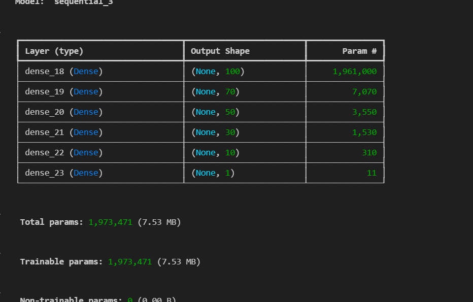

### deep-learning-challenge Module 21
# AlphabetSoup Charity

## Overview of the analysis: 
The purpose of the analysis is to help the nonprofit foundation Alphabet Soup to select the applicants for funding with the best chance of success in their ventures. 

## Data Preprocessing

What variable(s) are the target(s) for your model?
- IS_SUCCESSFUL is the target.
What variable(s) are the features for your model?
- all the variables other than IS_SUCCESSFUL.
What variable(s) should be removed from the input data because they are neither targets nor features?
- EIN and SPECIAL CONSIDERATIONS had to be removed.
- Compiling, Training, and Evaluating the Model

How many neurons, layers, and activation functions did you select for your neural network model, and why?

 
What steps did you take in your attempts to increase model performance?

- Removed EIN and SPECIAL CONSIDERATIONS FIELDS.
- increased the hidden layers and combination of neurons
- checked elu,tanh,sigmoid,relu. Settled to Sigmoid. 
- replaced the names who are selected < 5 times 

Summary: Summarize the overall results of the deep learning model. Include a recommendation for how a different model could solve this classification problem, and then explain your recommendation.
While the deep learning model achieved a respectable accuracy of around 79%, exploring alternative models like the Random Forest can potentially offer better performance and insights, especially if the current model is prone to overfitting or if computational resources are a constraint. By leveraging the strengths of ensemble methods, we can aim for improved classification accuracy and more robust model performance.

